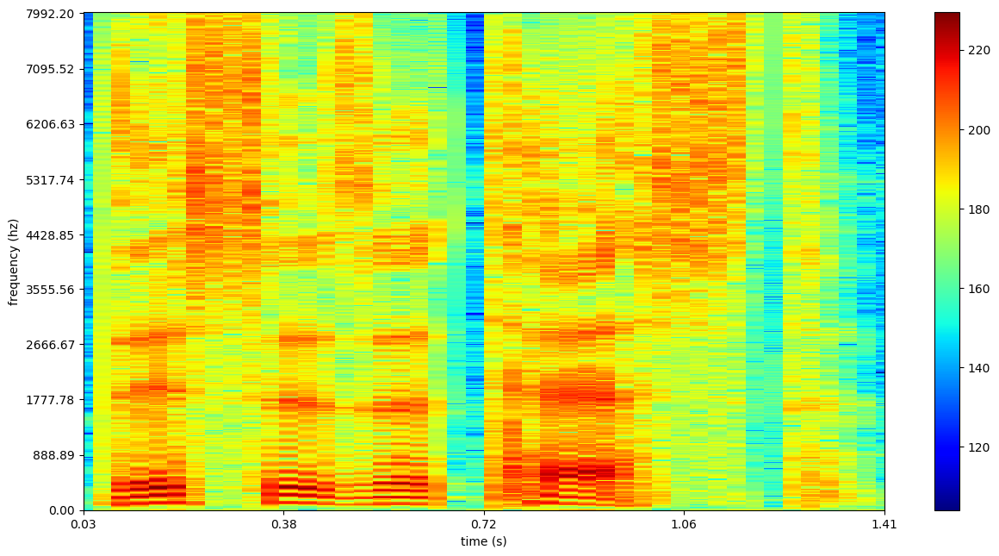
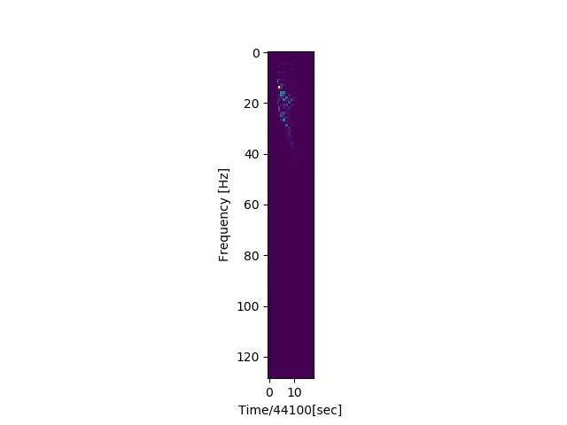
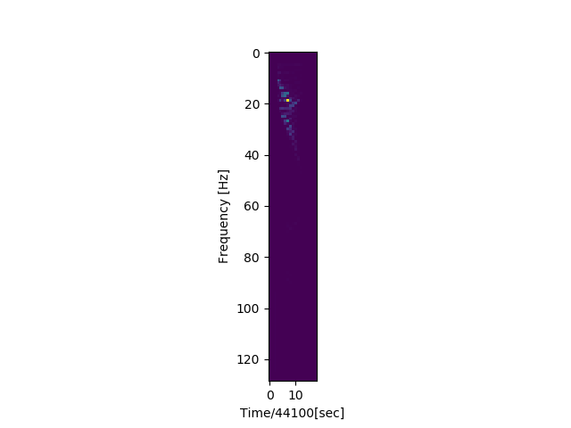
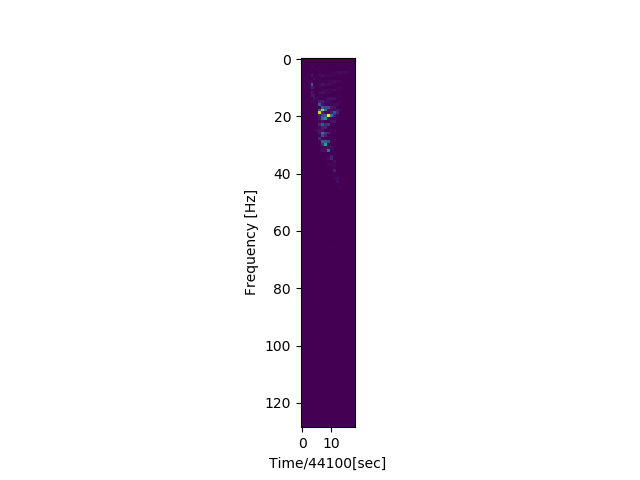
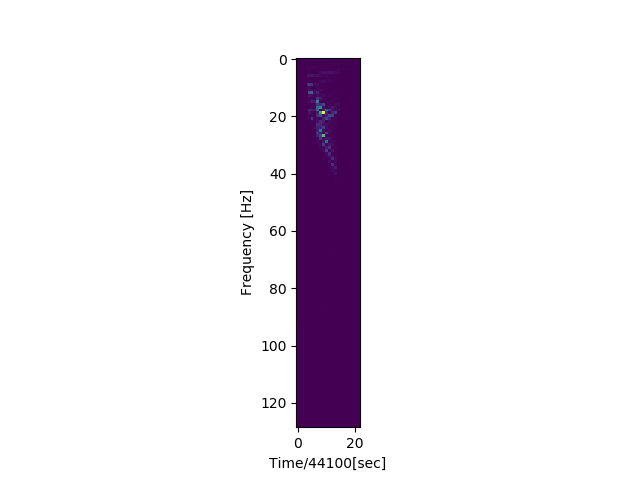
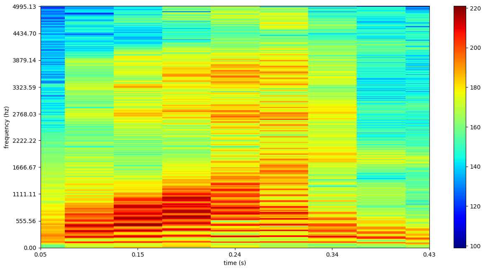
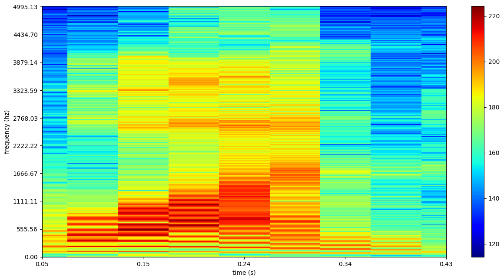
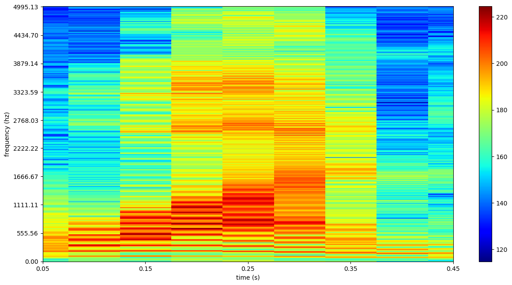
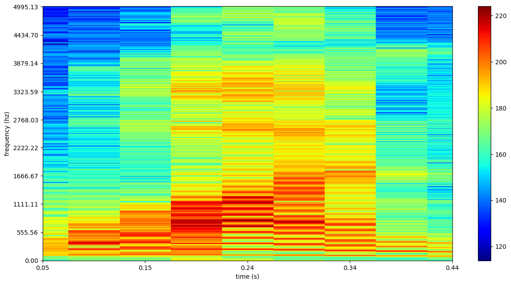
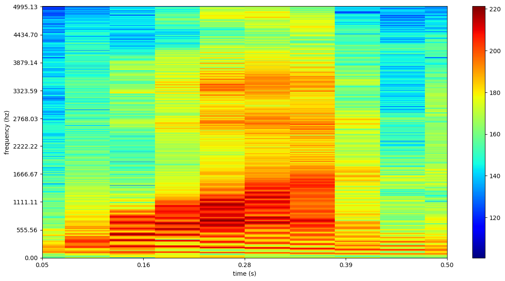

# Feature Extraction from Audio Files

This is an assignment for course completion of **AV493 - Machine Learning for Signal Processing**, at [Indian Institute of Space Science
and Technology](https://iist.ac.in). 

The aim of the assignment is to extract feature from Audio or `.wav` files
which can be used for recognition or further processing applications.

## Spectrogram

A spectrogram is a visual representation of the spectrum of frequencies of sound or other signal as they vary with time. Spectrograms are sometimes called sonographs, voiceprints, or voicegrams. When the data is represented in a 3D plot they may be called waterfalls.

Spectrograms are used extensively in the fields of music, sonar, radar, and speech processing, seismology, and others. Spectrograms of audio can be used to identify spoken words phonetically, and to analyse the various calls of animals.

A spectrogram can be generated by an optical spectrometer, a bank of band-pass filters or by Fourier transform.

Creating a spectrogram using the FFT is a digital process. Digitally sampled data, in the time domain, is broken up into chunks, which usually overlap, and Fourier transformed to calculate the magnitude of the frequency spectrum for each chunk. Each chunk then corresponds to a vertical line in the image; a measurement of magnitude versus frequency for a specific moment in time (the midpoint of the chunk). These spectrums or time plots are then "laid side by side" to form the image or a three-dimensional surface,[4] or slightly overlapped in various ways, i.e. windowing.

This process essentially corresponds to computing the squared magnitude of the short-time Fourier transform (STFT) of the signal

*s(t)*, i.e. for a window *w*, 

*spectrogram(t,w) = |STFT(t,w)|^2* 

Examples of Spectrograms generated are:

## Short Time Fourier Transform(STFT)

The short-time Fourier transform (STFT), is a Fourier-related transform used to determine the sinusoidal frequency and phase content of local sections of a signal as it changes over time. In practice, the procedure for computing STFTs is to divide a longer time signal into shorter segments of equal length and then compute the Fourier transform separately on each shorter segment. This reveals the Fourier spectrum on each shorter segment. One then usually plots the changing spectra as a function of time.

A window of fixed size is choosen and a fourier transform of the same windowed signal is done and laid vertically, then window is moved(with or without overlap) and the fourier transform is done and laid vertically beside the previous Fourier Transform, a collection of these provide STFT, as:

## How to run

The code is pretty state forward, as variable names have been defined properly, and function  names provide great insight into what they are doing.

To run the code:

* Run `spectrogram.py` to generate the spectrogram of all files as `.wav` in the whole directory.
* Run `stft.py` to generate the stft of all files as `.wav` in the whole directory.

Note: MFCCs are generated from the above two,

Few spectrograms from `digits_train` directory:

Few STFTs from `digits_train` directory:

## Conclusion

This work may be completed before beginning of the VIIth semester, by implementing
a HMM for training data which can learn and then on the test data predict the word spoken.
You can check this link for updates.